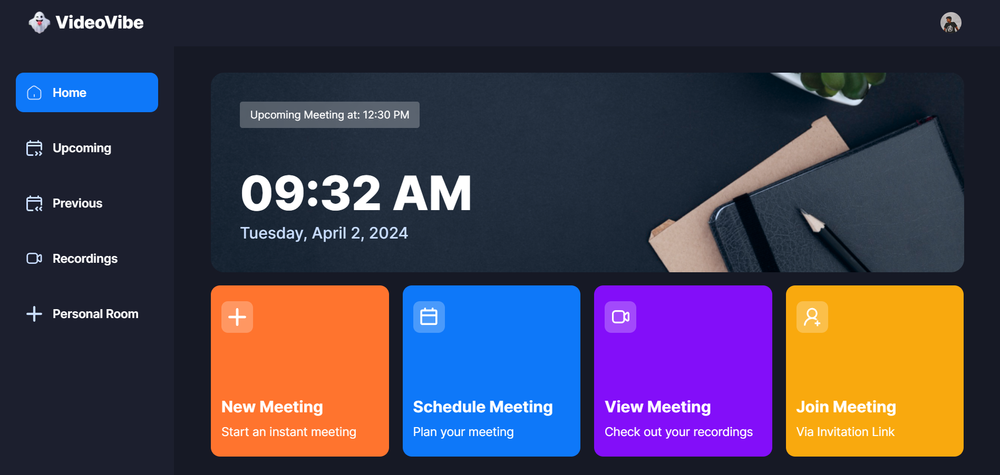

   <h1>🎥 VideoVibe </h1>
 
 

    
  

  <h1>🌐 Live Link</h1>
  

  
 ###  [SEE LIVE](https://video-vibe-stardust.vercel.app)
  
  <h1>🛠️ Tech Stack</h1>
  <ul>
    <li>🔗 Next.js</li>
    <li>📝 TypeScript</li>
    <li>🔒 Clerk</li>
    <li>🌊 getstream</li>
    <li>💡 shadcn</li>
    <li>🎨 Tailwind CSS</li>
  </ul>
  
  <h1>🔋 Features</h1>
  <ul>
    <li>🔑 Authentication: Implements authentication and authorization features using Clerk, allowing users to securely log in via social sign-on or traditional email and password methods, while ensuring appropriate access levels and permissions within the platform.</li>
    <li>🚀 New Meeting: Quickly start a new meeting, configuring camera and microphone settings before joining.</li>
    <li>🎮 Meeting Controls: Participants have full control over meeting aspects, including recording, emoji reactions, screen sharing, muting/unmuting, sound adjustments, grid layout, participant list view, and individual participant management (pinning, muting, unmuting, blocking, allowing video share).</li>
    <li>🚪 Exit Meeting: Participants can leave a meeting, or creators can end it for all attendees.</li>
    <li>📅 Schedule Future Meetings: Input meeting details (date, time) to schedule future meetings, accessible on the 'Upcoming Meetings' page for sharing the link or immediate start.</li>
    <li>🕰️ Past Meetings List: Access a list of previously held meetings, including details and metadata.</li>
    <li>📹 View Recorded Meetings: Access recordings of past meetings for review or reference.</li>
    <li>🏠 Personal Room: Users have a personal room with a unique meeting link for instant meetings, shareable with others.</li>
    <li>🔗 Join Meetings via Link: Easily join meetings created by others by providing a link.</li>
    <li>🛡️ Secure Real-time Functionality: All interactions within the platform are secure and occur in real-time, maintaining user privacy and data integrity.</li>
    <li>📱 Responsive Design: Follows responsive design principles to ensure optimal user experience across devices, adapting seamlessly to different screen sizes and resolutions.</li>
    <li>🧩 and many more, including code architecture and reusability.</li>
  </ul>

  <h1>🎉 Additional Highlights</h1>
  <ul>
    <li>🚀 Modern UI: A sleek and intuitive user interface designed for seamless navigation and interaction.</li>
    <li>💬 Real-time Chat: Integrated chat functionality for instant messaging during video calls.</li>
    <li>🌟 Emoji Reactions: Express emotions with a variety of fun emoji reactions during meetings.</li>
    <li>🎥 Screen Sharing: Share your screen to present slides, documents, or any other content during meetings.</li>
    <li>🔊 Sound Adjustment: Easily adjust audio settings to ensure crystal-clear sound quality.</li>
    <li>📜 Detailed Logs: Comprehensive logs of all meetings and interactions for easy reference and analysis.</li>
    <li>🔍 Search Functionality: Effortlessly search through past meetings, recordings, and chat messages for quick retrieval.</li>
    <li>🔒 End-to-End Encryption: Ensures that all communication within the platform is fully secure and encrypted.</li>
    <li>📊 Analytics Dashboard: Gain insights into meeting attendance, engagement, and other key metrics through an intuitive analytics dashboard.</li>
  </ul>

  <h1>🚀 Future Plans & Contributions</h1>
  
Our journey doesn't stop here! We're constantly evolving and improving VideoVibe. Some exciting future plans and opportunities for contributions include:

  <ul>
    <li>🔨 Implementing more advanced collaboration features like whiteboarding and document sharing.</li>
    <li>🌱 Enhancing accessibility to ensure that VideoVibe is usable by everyone, regardless of ability.</li>
    <li>🎨 Expanding customization options for user profiles and meeting rooms.</li>
    <li>🛠️ Developing plugins and integrations with popular productivity tools.</li>
    <li>📚 Building comprehensive documentation and tutorials for developers and users.</li>
    <li>💡 Welcoming contributions from the community to improve VideoVibe's functionality and user experience.</li>
  </ul>

  

    <h2>🚀 "Dream big and dare to fail." - Norman Vaughan 🌟</h2>
  

